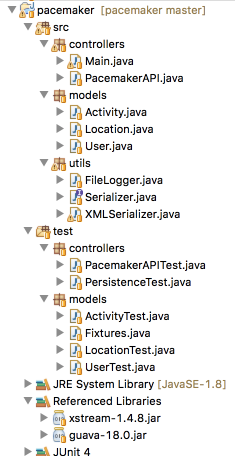

#Test Packages

Currently the app is structured like this in eclipse:

The test classes should be adjusted to better align with the packages they are testing. Refactor the project to look like this:

It should be possible to do this just using drag and drop within the package explorer.
