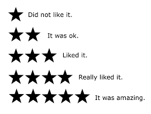

##Overview

Many companies use recommender systems to suggest products, information, and friends to their customers . These systems analyse usage patterns to suggest what a user would prefer from among a collection of things he has never experienced.

Recommender systems are big business - recently  Netflix ran an open competition for a recommender algorithm. The winners prize was $1 million. In this assignment, you will develop a similar recommender algorithm for Movies but, unfortunately, there's no cash prize involved.

The main aims of this assignment is to write a Java program that can:

- Load existing book, user and rating data into a Java program. 
- Develop a suitable data serializer.
- Create a suitable API to view and manipulate books, user, and rating data.
- Make movie recommendations for user.
- Provide unit testing which provides adequate code coverage and uses C.O.R.R.E.C.T. and Right B.I.C.E.P guidelines

